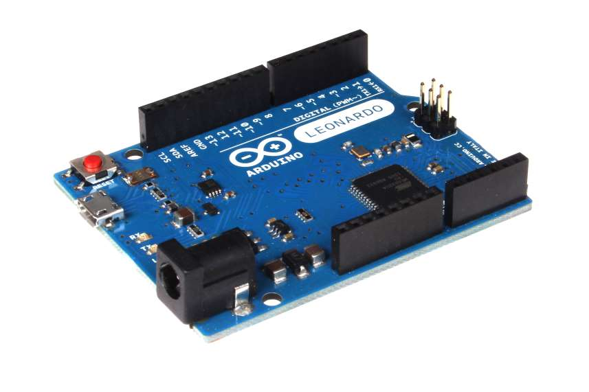

# PS4KeypadShield

Code to use an LCDKeypadShield to control your Playstation 4 (PS4). Can be used for custom controller inputs eg handbrake or for scripting in game activities

 \+  \= 

This builds on the back of the [PS4Arduino](https://github.com/Flamethr0wer/PS4Arduino/) project which has a great video to explain its back story: [https://www.youtube.com/watch?v=xxhVH7Ijhp0](https://www.youtube.com/watch?v=xxhVH7Ijhp0). I used that project to script a trophy and explored making it more interactive which I've done with one of the many LCDKeypadSheilds available which is a cheap way to get a 1602 display and a few buttons.

The biggest challenge I had was executing a series of steps over and over while allowing it to be cancelled by pressing a button. Turns out this is quite a jump from using `delay(1000)` everywhere. Delay is blocking so your Arduino will not respond to inputs on the buttons, the alternative is to use timers which keeps it responsive but makes it more complicated to run the script. Timers and state machines work well however it made writing the script complicated.

## Step-by-step

This section is a step-by-step guide for people newer to the Arduino ecosystem. It will guide you through getting the required software to flash your Arduino and control your PS4.

### Plan

1. Pre-requisites
2. Flash
3. Test
4. Iterate
5. Restore

### 1. Pre-requisites

You'll need to assemble the following:

1. Arduino IDE to edit the sketch - [official docs for download and install](https://docs.arduino.cc/software/ide-v2/tutorials/getting-started/ide-v2-downloading-and-installing/)
2. PS4Arduino-AVR, follow [instructions](https://github.com/Flamethr0wer/PS4Arduino-AVR/blob/master/README.md) linked at top
3. Install libraries. Follow the [official library install docs](https://docs.arduino.cc/software/ide-v2/tutorials/ide-v2-installing-a-library/) to install the libraries at the top of the code.
  - spin-timer
  - arduino-display-lcdkeypad
  - safestring
  - ps4arduino 
5. A physical Arduino board, see supported boards at [PS4Arduino](https://github.com/Flamethr0wer/PS4Arduino/)

### 2. Flash

This step will update the board's identity and upload a sketch to your Arduino. The sketch will cause the controller to pause, move to the right, pause, move back to the left and repeat over and over.

There are three steps to this:

1. Change board to "____ as PS4 controller"
2. Enter sketch code
3. Upload to Arduino

#### 2.1. Change board to "____ as PS4 controller"

For a standard board, this should be simple the first time. Once connected, the board should appear in the Arduino IDE menu Tools > Ports.

In order for the PS4 to recognise the Arduino as a controller, part of its firmware needs to be updated to be non-standard. This is so it can report to the PS4 that it is a controller rather than an Arduino. This has the side effect of making it not show up in the Arduino IDE next time on your computer but more on that below.

1. Connect board, confirm it appears in Tools > Ports. It will shows as `COMn` on windows where n is a number eg `COM8`.
2. Override board type by selecting Tools > Board "{your board}" > "PS4Arduino AVR Boards" > "{your board} as PS4 contoller"

> [!NOTE]
> Once the board is changed it will not appear under the Tools > Ports menu. See [4. Iterate](#4-iterate) below for details.

#### 2.2. Enter sketch code

The sketch code is below, copy and paste this into the Arduino IDE:

```
#include "PS4Arduino.h"

void setup() {
  PS4controller.begin();
}

void loop() {
  delay(2000);
  PS4controller.setDpad(DPAD_E);         // D-pad right
  delay(50);
  PS4controller.setDpad(DPAD_RELEASED);  // D-pad unpressed

  delay(2000);                           // wait 2 seconds
  PS4controller.setDpad(DPAD_W);         // D-pad left
  delay(50);
  PS4controller.setDpad(DPAD_RELEASED);  // D-pad unpressed

  PS4controller.maintainConnection();    // keep connected
}
```

This is a simple right/left loop to test the toolchain and does not use the keypad or LCD. See [src/PS4KeypadShield.ino](src/PS4KeypadShield.ino) for more complex code that uses the keypad and LCD.

#### 2.3. Upload to Arduino

As the board is connected as a regular Arduino, this step is the same as other uploads: click the upload button.

For future uploads, it will be different since the board is telling your computer that it is a PS4 controller rather than Arduino. See [4. Iterate](#4-iterate) below.

### 3. Test

Now is the time to take your flashed Arduino and connect to your PS4. The best way to do this is as follows:

1. Turn on PS4 (normally with controller)
2. Get to a screen where you can test the code. In our example the home screen is ok
3. If turned on with controller, press and hold the ps button on controller for 10 seconds for it to turn off
4. Connect Arduino with usb cable
5. Observe your sketch running!

> [!NOTE]
> If you cannot see anything on the display and it is the first time you have used it, it is likely you need to adjust the dispay by turning the pentiometer (top left) clockwise a number of times. Do this with the unit powered on so you can see the change in display.

### 4. Iterate

As your board is now the "____ as PS4 controller" version, it will not show up on the Tools > Ports menu like it used to. This is a side effect of having it appear as a PS4 Controller.

Do not fear! It is still possible to upload the image, you just need to try this one easy trick:

1. Make the modification in your sketch.
    - Now is a great time to checkout the main demo [src/PS4KeypadShield.ino](src/PS4KeypadShield.ino) which provides simple navigation with up/down/left/right. Also see the other [src/examples](src/examples/) for more demonstrations.
3. Click the upload icon (or Sketch > Upload)
4. While it is compiling, press the reset button on your Arduino
    - On Windows with the Arduino IDE, this can be done after the "Compiling sketch..." notification changes to "Uploading..."
    - If you get an upload error try pressing the reset button earlier or later

### 5. Restore

**OPTIONAL**: If you wish to return your Arduino back to "normal" then you will need to reverse the change board steps above:

1. In the Arduino IDE, load a standard sketch eg Blink by File > Examples > 01 Basics > Blink
2. Set board type back to normal by selecting Tools > Board "{your board}" > "Arduino AVR Boards" > "{your board}"
3. Upload the standard AVR and sketch following steps above ie click upload then press reset on the Arduino board

## Troubleshooting

### error: 'PS4ARDUINO_RX_ENDPOINT' was not declared in this scope

This error occurs if you are trying to use the PS4Arduino library but have not use the PS4Arduino-ARV to change the board type. Instructions [here](https://github.com/Flamethr0wer/PS4Arduino-AVR/blob/master/README.md).

### Failed uploading: uploading error: exit status 1

This can occur after you have used the board "_____ as PS4 controller" (PS4Arduino-AVR) as it shows up to the computer as a game controller rather than an Arduino.

To fix this, start uploading your sketch and press the reset button on the Arduino board. More details above under [4. Iterate](#4-iterate) above.

## References

* Forum post with idea about double loop()s: https://forum.arduino.cc/t/calling-void-loop-as-a-function-inside-program/311764/10
* Note abobut having to turn the brightness a lot!: https://github.com/neuronupheaval/arduinotimer
* Keypad library (also in source): https://github.com/dniklaus/arduino-display-lcdkeypad
* Bad backlight controls?
  * More info here: https://forum.arduino.cc/t/warning-to-users-of-some-vendors-lcd-keypad-shields/94673
  * Check sketch: https://github.com/duinoWitchery/hd44780/blob/master/examples/ioClass/hd44780_pinIO/LCDKeypadCheck/LCDKeypadCheck.ino
  * If impacted, easiest option is to leave backlight on always by breaking off pin D10
* 
